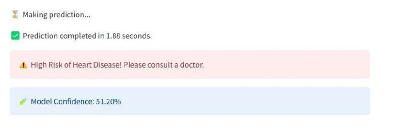

# Coronary Artery Disease Prediction Using Machine Learning

This project focuses on predicting the risk of **Coronary Artery Disease (CAD)** using machine learning techniques. CAD is one of the leading causes of death worldwide, and early detection plays a crucial role in improving patient outcomes and reducing healthcare costs. The system uses ensemble learning models to provide accurate and reliable predictions based on patient health indicators.

The project also includes an interactive **Streamlit web application** that allows users to input health parameters and receive real-time CAD risk predictions.

---

## Project Overview

The objective of this project is to design and develop a machine learning–based system capable of predicting CAD risk at an early stage. The model is trained using the **Indicators of Heart Disease (2022 update)** dataset obtained from Kaggle. Advanced data preprocessing, feature engineering, and ensemble learning techniques are applied to improve prediction accuracy and robustness.

---

## Key Features

- Early prediction of Coronary Artery Disease (CAD)
- Ensemble learning using Voting and Bagging classifiers
- Data preprocessing, feature engineering, and dimensionality reduction
- Handling class imbalance using SMOTE
- Interactive Streamlit-based web interface
- Real-time prediction with confidence scores

---

## Dataset

- **Source:** Kaggle – Indicators of Heart Disease (2022 Update)
- **Records:** 319,794 (expanded to 548,911 after SMOTE)
- **Key Features:**
  - Age Category
  - BMI
  - Smoking
  - Alcohol Drinking
  - Physical Health
  - Mental Health
  - Sleep Time
  - Physical Activity
  - Diabetes
  - General Health
  - Other lifestyle and health indicators

---

## Methodology

1. **Data Collection**
   - Loaded the Kaggle heart disease dataset.

2. **Data Preprocessing**
   - Removed duplicate records
   - Handled missing values
   - Encoded categorical variables using One-Hot Encoding
   - Normalized numerical features using Z-score normalization

3. **Feature Engineering**
   - Created a combined **Health Score** using physical and mental health values
   - Applied **Principal Component Analysis (PCA)** to select important features

4. **Handling Class Imbalance**
   - Used **SMOTE (Synthetic Minority Oversampling Technique)**

5. **Model Training**
   - Decision Tree
   - Random Forest
   - Gradient Boosting
   - Voting Classifier (Soft Voting)
   - Bagging Classifier (Random Forest)

6. **Model Evaluation**
   - Accuracy
   - Precision
   - Recall
   - F1-Score
   - ROC-AUC Curve

---

## Best Performing Model

- **Bagging Classifier (Random Forest)**
- Achieved approximately **89% accuracy**
- Reduced overfitting and improved generalization

---

## Web Application

The trained model is deployed using **Streamlit**, providing a user-friendly interface where users can:
- Enter health-related details
- Submit inputs for prediction
- View CAD risk results with confidence levels

---

## Technologies Used

### Programming & Libraries
- Python
- NumPy
- Pandas
- Scikit-learn
- Imbalanced-learn (SMOTE)

### Machine Learning
- Random Forest
- Decision Tree
- Gradient Boosting
- Voting Classifier
- Bagging Classifier
- PCA

### Visualization
- Matplotlib
- Seaborn
- Plotly

### Deployment
- Streamlit
- Google Colab (for model training)

---

## Results & Conclusion

The project demonstrates that ensemble machine learning techniques significantly improve the accuracy and reliability of CAD prediction. Early detection using this system can assist healthcare professionals in making informed decisions and help patients take preventive measures at the right time.

---

## Output Screenshots

| Input Form | Prediction Result |
|------------|------------------|
|  |  |

### Prediction Result

## Author

Madhu Vignesh R  
MCA | Machine Learning
